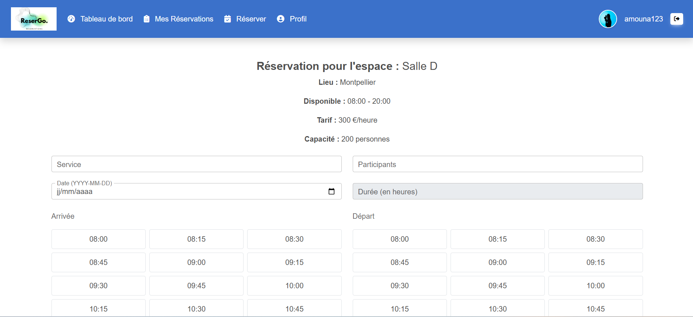
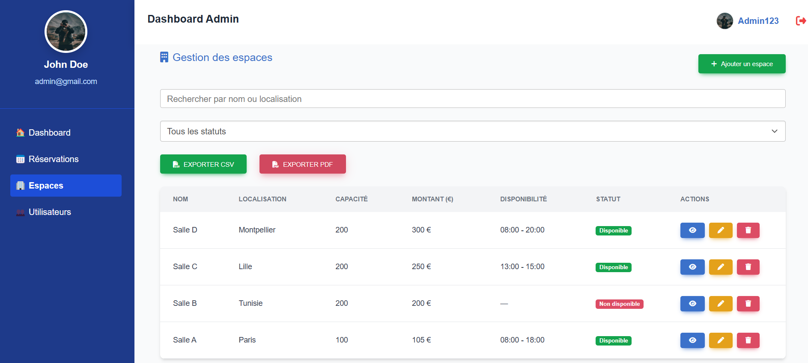

# 🏨 Application de Réservation

Ce projet est une application complète de réservation (ex: salles, événements, chambres), avec une interface utilisateur et administrateur, utilisant React pour le frontend, Node.js/Express pour le backend, et Firebase pour la gestion des utilisateurs et de la base de données.

---

## ✨ Fonctionnalités principales

### Utilisateur

- 📅 Sélection des créneaux via un calendrier interactif
- ✅ Visualisation des disponibilités en temps réel
- 💳 Paiement fictif simulé
- 📋 Dashboard personnel : voir mes réservations récentes (3 derniers)
- 📋 Gestion des réservations : voir mes réservations + modifier une réservation + supprimer une reservation + filtres + exportation tableau en pdf et csv
- 📋 Consulter les espaces disponibles
- 📋 Gestion de mon profil : voir mon profil + modifier mon profil

### Administrateur

- ➕ Création et gestion des réservations (possibilité de confirmer/refuser une réservation et de confirmer une demande d'annulation)
- ➕ Gestion des espaces
- 👥 Gestion des utilisateurs (Affichage + modification + suppression)
- 🗃️ Accès aux statistiques ou liste des réservations et des espaces récents (3 derniers)
- 👥 Gestion de profil Admin

## ⚙️ Technologies utilisées

- **Frontend** : React, MDB Bootstrap
- **Backend** : Node.js, Express
- **Base de données / Auth** : Firebase
- **Autres** : JWT pour l’authentification, Multer pour les fichiers, etc.

## 📁 Structure du projet

```

app-reservation/
│
├── backend/ # Serveur Node.js
│ ├── config/ # Configuration Firebase
│ ├── controllers/ # Logique métier (authentification, réservations)
│ ├── middlewares/ # Middlewares (auth)
│ ├── routes/ # Routes API (auth, protégées)
│ └── uploads/ # Images uploadées
│
├── frontend/ # Application React
│ ├── public/
│ ├── src/
│ │ ├── assets/
│ │ ├── components/ # Composants réutilisables
│ │ ├──── admin/ # Pages principales de l'admin
│ │ ├──── authentification/ # Pages principales de l'authentification
│ │ ├──── users/ # Pages principales de l'utilisateur
│ │ ├──── styles/ # Page css de style
│ │ ├── contexts/ # Contexte de l'utilisateur
│ │ ├── images/ # images utilisés dans l'application
│ │ ├── services/ # fichiers de consommation des apis de backend
│ │ ├── images/ # images utilisés dans l'application
│ │ └── App.js # Configuration des routes
│ │ └── Firebase.js # Configuration de firebase
│ │ └── .env #fichier d'environnement (config) (j'ai importé .env.exemple il faut mettre les valeur de config de firebase)
│
├── README.md
└── LICENSE
```

## 🧪 Installation & Lancement

### 🔧 Prérequis

- Node.js v16+

- Compte Firebase configuré

1. Backend

```
cd backend
npm install
npm run dev
```

2. Frontend

```
cd frontend
npm install
npm start
```

## 🔐 Authentification

- Utilisation de Firebase Auth

- Gestion des rôles (user, admin) via Firestore ou claims personnalisés

## 💾 Base de Données (Firebase)

```
users/
  └── {userId}
        ├── username
        ├── role: "user" | "admin"
        └── email
        └── firstName
        └── lastName
        └── ...

spaces/
  └── {spaceId}
        ├── available :boolean
        ├── availableFrom
        └── availableTo
        └── capacity
        └── location
        └── montant
        └── name

reservations/
  └── {reservId}
        ├── code_reservation
        ├── commentaires
        └── createdAt
        └── date
        └── description
        └── duree
        └── heure_arrivee
        └── heure_depart
        └── lieu
        └── mode_paiement
        └── modifications : []
        └── annulations : []
        └── rappels : []
        └── participants
        └── service
        └── status
        └── spaceId
        └── utilisateurId
```

## 📸 Captures d’écran

### Interfaces d'authentification

#### Page de Login

- La connexion se fait avec l'email et le mot de passe on a des vérification des champs et de l'existance de l'utilisateur dans la base de donnée
- On peut faire la connexion avec le compte Google


#### Page d'inscription

- On peut faire l'inscription d'un utilisateur
- On a les vérifications nécessaires
- On peut faire l'inscription avec le compte Google


#### Pages de résiliation de mot de passe

- L'utilisateur peut modifier son mot de passe
- Il doit taper son email (capture 1)
- Un email personnalisé (configuré sur firebase) va être envoyé sur l'email écrit avec un lien de résiliation qui le dirige vers la page de modification (capture 2)

<p align="center">
  
  
</p>

### Interfaces d'utilisateur

#### Page de tableau de bord utilisateur

- Vue Globale sur les réservations récentes passées par l'utilisateur connecté


#### Gestion des reservations (Page Mes réservation)

- Affichage de tableau de liste des réservations passés par l'utilisateur avec statut (confirmée, en cours, annulées ...)
- Possibilité de supprimer une réservation


- Possibilité de modifier une réservation avec un tableau des modifications déjà passés
- Possibilité de demander une annulation d'une réservation


#### Création d'une réservation

- Affichage de la liste des espaces diponibles
  

- Etape 1 : remplir les informations qui concerne la réservation + choix de crénaux (si crénaux réservés seront désactivés) avec les vérification nécessaires

<p align="center">
  
  
</p>

- Etape 2 : faire le paiment ( dans ce cas on calcule le montant à payer mais le paiement ne se fait pas réellemnt)


- Etape 3 : Récapitulatif de la demande


#### Profil utilisateur

- Affichage de profil utilisateur
- Possibilité de modifier les infos de l'utilisateur
  

### Interfaces d'administrateur

#### Tableau de bord de l'admin

- cette page contient les différents statistiques sur les réservations / les espaces et les utilisateurs
  
- Affichage des réservations récentes avec les statut
- Affichage de la liste des salles disponibles/non disponibles
  

#### Gestion des réservation

- Affichage de la liste des réservation à venir


- Affichage de la liste des réservation archivées


- Filtres de status + recherche + exportation en pdf ou csv

- Page de consutation d'une réservation ou l'admin peut consulter les infos les modifications faites...
- Possibilité de supprimer une réservation
- Accepter/refuser une réservation
- Accepter une annulation


#### Gestion des espaces

- Affichage de la liste des espaces + filtres
- Possibiilité de supprimer un espace



- Possibilité d'ajouter un espace


- Possibilité de modifier un espace


#### Gestion des utilisateurs

- Affichage de la liste des utilisateur
- Possibiilité de supprimer un utilisateur


- Possibilité d'ajouter un utilisateur


- Possibilité de consulter un utilisateur
- Possibilité de supprimer un utilisateur
- Possibilité de modifier le role d'un utilisateuur


#### Profil administrateur

- Affichage de profil admin
- Possibilité de modifier les infos de l'admin
- Possibilité de modifier le mot de passe
  

## 🚀 Déploiement

- Backend : Heroku, Render, ou Railway

- Frontend : Vercel, Netlify ou Firebase Hosting

## 🧑‍💻 Auteurs

- [Amani GHARBI](https://github.com/amanigharbi) ; Développeuse principal

## 📄 Licence

- Ce projet est sous licence MIT – voir le fichier LICENSE pour plus d’informations.
